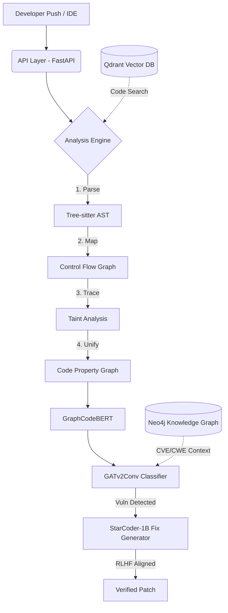

<div align="center">
  
  <h1>SecureAI Platform</h1>
  <p><strong>Enterprise-Grade Autonomous Vulnerability Detection & Remediation System</strong></p>
  <p>
    Powered by <strong>Graph Neural Networks</strong>, <strong>RLHF</strong>, and a <strong>Semantic Knowledge Graph</strong>
  </p>
  
  <p>
    <a href="#architecture">Architecture</a> •
    <a href="#features">Features</a> •
    <a href="#demo">Demo</a> •
    <a href="#getting-started">Getting Started</a>
  </p>
</div>

---

## 🎯 Executive Summary
SecureAI is an advanced, AI-driven static application security testing (SAST) platform. Unlike traditional regex-based scanners, SecureAI deeply understands code semantics by compiling source code into **Code Property Graphs (CPGs)** and analyzing them using a hybrid **GraphCodeBERT + GATv2Conv** model. 

When vulnerabilities are detected, SecureAI leverages an **RLHF-aligned LLM** (Direct Preference Optimization on StarCoder) to autonomously generate compilable, security-correct patches, effectively shifting security left without slowing down developer velocity.

---

## 🎥 Dashboard Demo

The platform features a modern, real-time 3D dashboard built with Next.js 15, Framer Motion, and React Three Fiber.


---

## 🚀 Key Differentiators & Technical Depth

### 1. Structural Code Understanding (AST → CFG → CPG)
- Built a custom **Tree-sitter** engine that parses Python and JavaScript into Abstract Syntax Trees (AST).
- Transforms the AST into **Control Flow Graphs (CFG)** and performs interprocedural **Taint Analysis** to track user-controlled input.
- Merges all representations into a unified **Code Property Graph (CPG)**, which is serialized into `torch_geometric.Data` objects for ML ingestion.

### 2. Deep Learning Vulnerability Classifier (GNN)
- Replaces brittle static rules with a hybrid architecture.
- **Node Embeddings:** Extracts 768-dimensional token semantics using `microsoft/graphcodebert-base`.
- **Structural Analysis:** Processes the CPG via Graph Attention Networks (`GATv2Conv`), allowing the model to learn complex, long-range vulnerability patterns that traditional tools miss.

### 3. RLHF-Aligned Fix Generator (DPO)
- Fine-tuned `StarCoder2-1B` via LoRA to generate code patches.
- Utilized **Direct Preference Optimization (DPO)** to align the model specifically for security contexts—training it to strongly prefer syntactically valid and secure code over plausible but broken generated patches.

### 4. Semantic Knowledge Graph
- **Neo4j** acts as the central brain, continuously syncing with the **NIST NVD API** to track emerging CVEs mapped directly to the MITRE **CWE Taxonomy**.
- **Qdrant Vector Database** indexes the codebase, enabling millisecond semantic code search (e.g., *"Find all SQL queries missing parameterized inputs"*).

### 5. Developer Workflow Integrations
- **Web Dashboard:** A highly interactive Next.js application for SOC teams.
- **VS Code Extension:** Real-time editor diagnostics with one-click "AI Quick Fixes".
- **GitHub PR Bot (Probot):** Automates PR reviews by hooking into `pull_request.opened` events and leaving inline security comments.
- **MLOps:** Complete `MLflow` experiment tracking and a Continuous CVE Adaptation pipeline to retrain models incrementally on new exploits.

---

## 🏗 System Architecture



---

## 💻 Tech Stack
* **AI / ML**: PyTorch, PyTorch Geometric, Hugging Face Transformers, TRL (DPO), MLflow
* **Code Analysis**: Tree-sitter, NetworkX
* **Backend**: Python 3.10+, FastAPI, Celery
* **Databases**: PostgreSQL, Neo4j, Qdrant, Redis
* **Frontend**: Next.js 15, React, TailwindCSS, Framer Motion, React Three Fiber
* **Infrastructure**: Docker, Docker Compose
* **Interfaces**: GitHub Probot, VS Code API Extension

---

## 🚦 Getting Started

### Prerequisites
- Docker & Docker Compose
- Python 3.10+
- Node.js 18+

### Installation

1. **Clone & Install Backend**
```bash
git clone https://github.com/tamimchowdhury/secureai.git
cd secureai
pip install -e ".[dev]"
```

2. **Start Infrastructure Services**
```bash
docker-compose up -d
```

3. **Run the API Server**
```bash
make api
# Available at http://localhost:8000
```

4. **Run the 3D Web Dashboard**
```bash
make web
# Available at http://localhost:3000
```

---

## 🧪 Testing & Validation
The platform includes rigorous unit tests and model evaluation scripts tracking F1, Precision, Exact Match (EM), and Syntactic Pass Rates.

```bash
# Run unit tests
make test

# Lint & Format
make lint
make format
```

---

## 🛡️ License
Built for educational and portfolio demonstration purposes.

---

<div align="center">
  <b>Designed and Engineered by Tamim Chowdhury</b>
</div>
